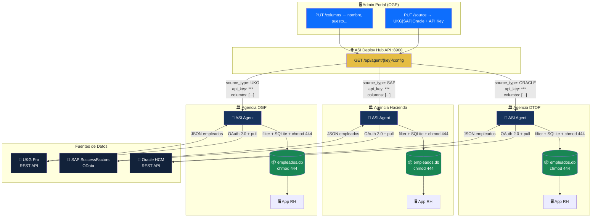
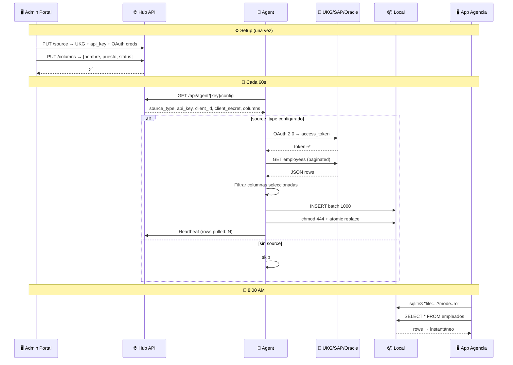
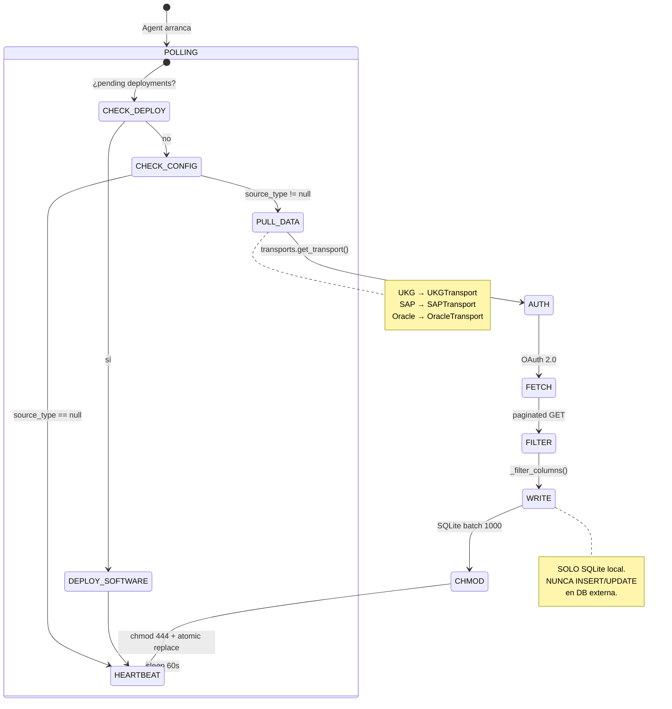
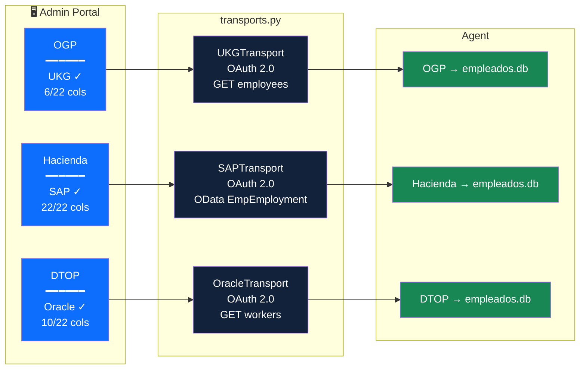
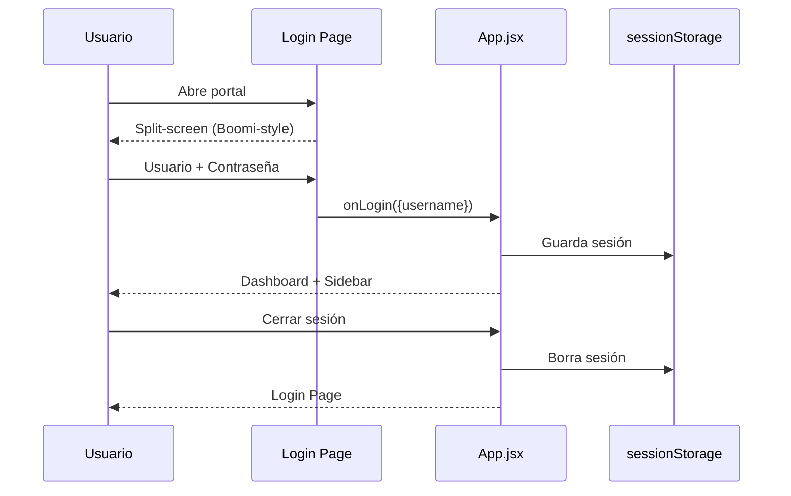
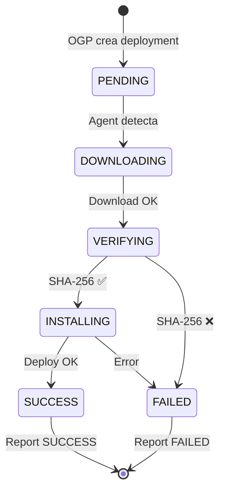
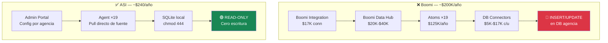

# ASI Architecture — Mermaid Diagrams

## System Overview

Cada agencia tiene **UNA** fuente. El Agent jala directo de UKG, SAP, u Oracle según lo configurado en el portal.



---

## Data Flow — Diario (por agencia)



---

## Agent Internals



---

## Portal Admin — Endpoints

```mermaid
graph LR
    subgraph Portal["🖥️ Admin Portal (React)"]
        LOGIN["🔐 Login<br/>Boomi-style"]
        DASH["📊 Dashboard"]
        AGENCIES["🏛️ Agencias"]
        DEPLOY["🚀 Deployments"]
    end

    subgraph API["🌐 Hub API (FastAPI :8900)"]
        E1["PUT /source"]
        E2["PUT /columns"]
        E3["GET /config"]
        E4["GET /pending"]
        E5["POST /heartbeat"]
    end

    subgraph DB[("SQL Server")]
        AG[("agencies")]
        REL[("releases")]
        DEP[("deployments")]
    end

    LOGIN --> DASH
    DASH --> AGENCIES
    DASH --> DEPLOY

    AGENCIES --> E1
    AGENCIES --> E2
    E1 --> AG
    E2 --> AG

    E4 --> DEP
    E4 --> REL

    style LOGIN fill:#0D6EFD,color:#fff
    style DASH fill:#0D6EFD,color:#fff
    style AGENCIES fill:#12223A,color:#fff
    style DEPLOY fill:#12223A,color:#fff
    style E1 fill:#E5BD44,color:#12223A
    style E2 fill:#E5BD44,color:#12223A
    style E3 fill:#E5BD44,color:#12223A
    style AG fill:#198754,color:#fff
```

---

## Configuración por Agencia



---

## Login Flow



---

## Agent Deployment Lifecycle



---

## Comparativa Boomi vs ASI


