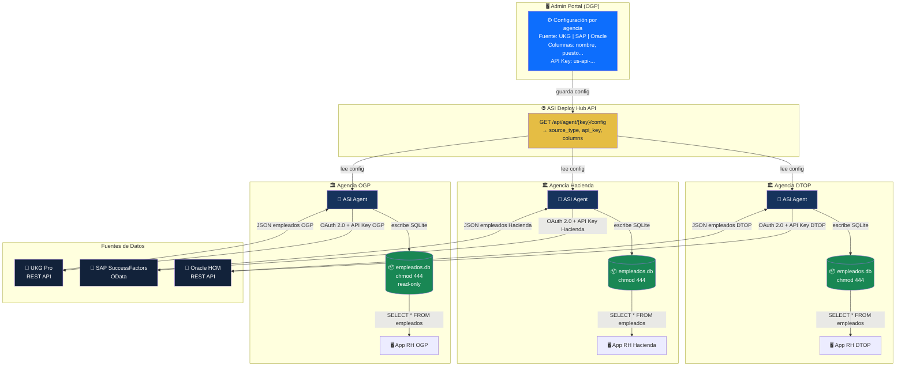
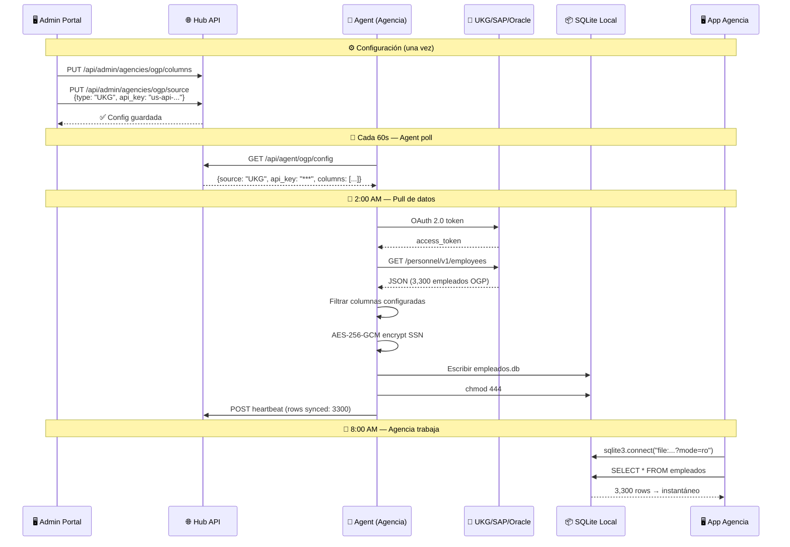
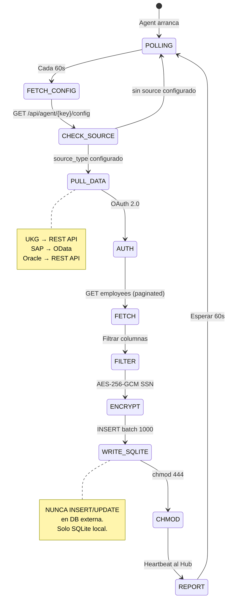
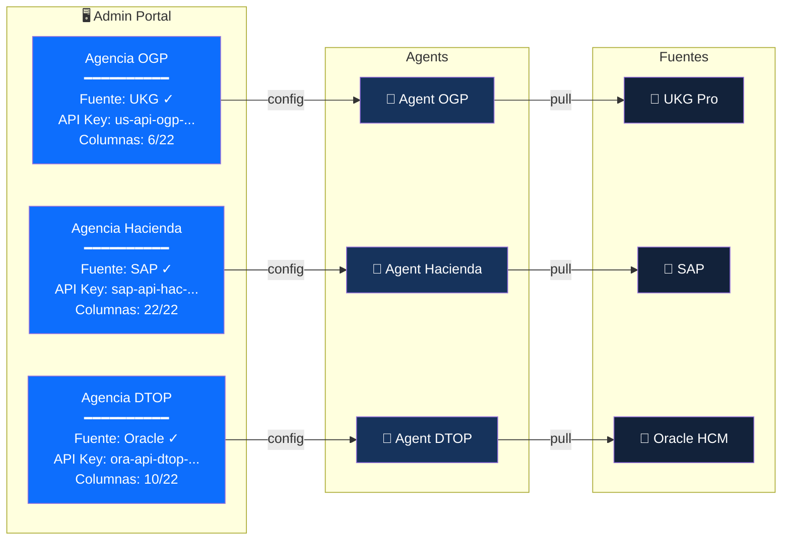
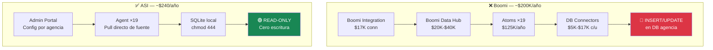
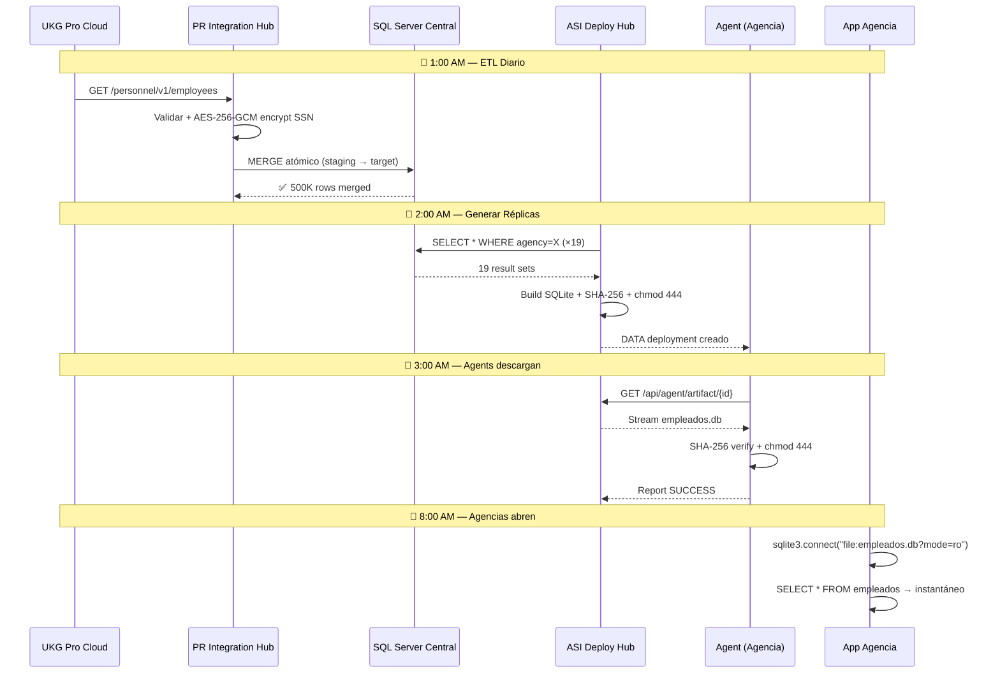
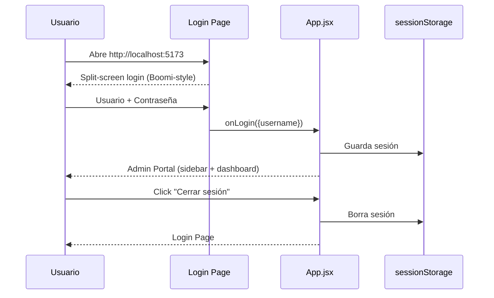
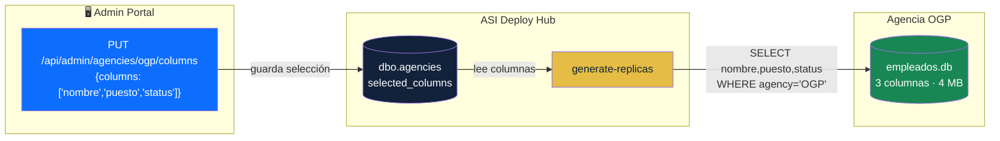
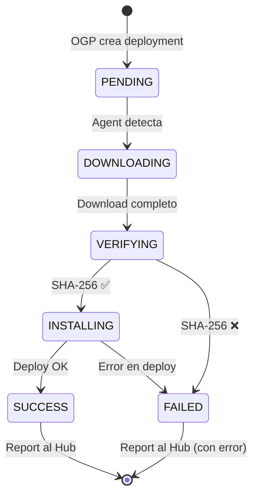

```mermaid
graph TB
    subgraph Boomi["❌ Boomi — ~$200K/año"]
        B1["Boomi Integration<br/>$17K conn"]
        B2["Boomi Data Hub<br/>$20K-$40K"]
        B3["Atoms ×19<br/>$125K/año"]
        B4["DB Connectors<br/>$5K-$17K c/u"]
        B5["🔴 INSERT/UPDATE<br/>en DB agencia"]
    end

    subgraph ASI["✅ ASI — ~$240/año"]
        A1["PR Integration Hub<br/>$0"]
        A2["ASI Deploy Hub<br/>$0"]
        A3["Agents ×19<br/>$0"]
        A4["SQLite replicas<br/>$0"]
        A5["🟢 chmod 444<br/>read-only"]
    end

    B1 --> B2 --> B3 --> B4 --> B5
    A1 --> A2 --> A3 --> A4 --> A5

    style B5 fill:#DC3545,color:#fff
    style A5 fill:#198754,color:#fff
```

# ASI Architecture — Mermaid Diagrams

## System Overview (CORREGIDO)

Cada agencia tiene **UNA** fuente de datos. El Agent jala directo de UKG, SAP, u Oracle según lo configurado en el portal.

---

## Data Flow — Diario (por agencia)

---

## Agent Internals

---

## Configuración por Agencia (Portal Admin)

---

## Comparativa Boomi vs ASI

---

## Data Flow — Diario

---

## Login Flow

---

## Column Selection

---

## Agent Deployment Lifecycle

---

## Comparativa Boomi vs ASI

