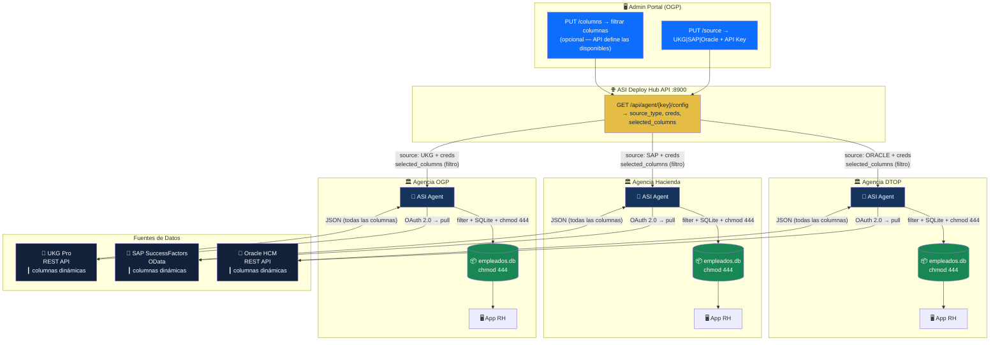
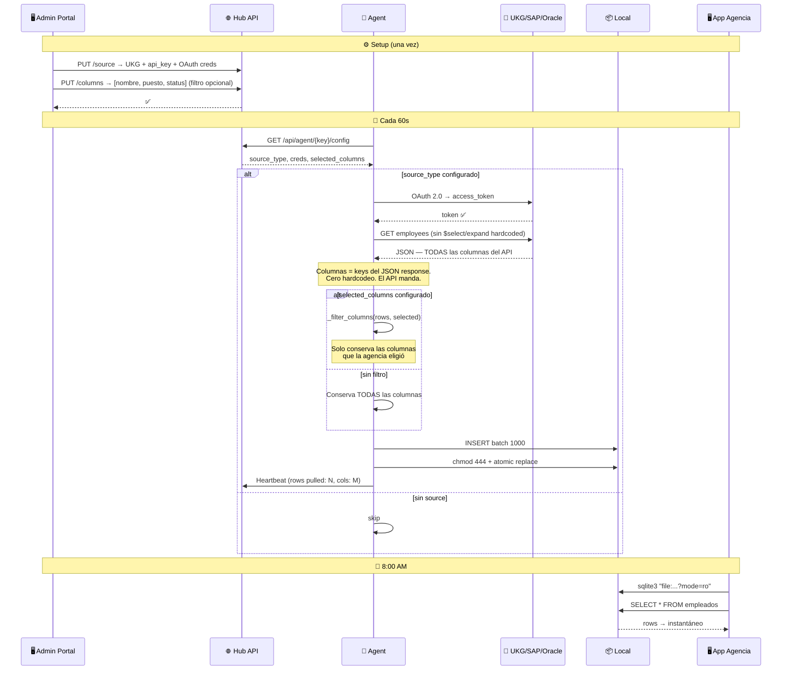
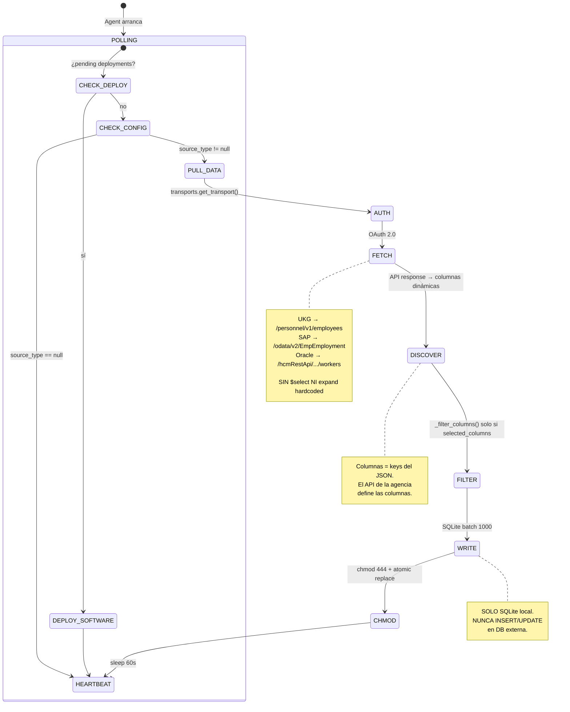
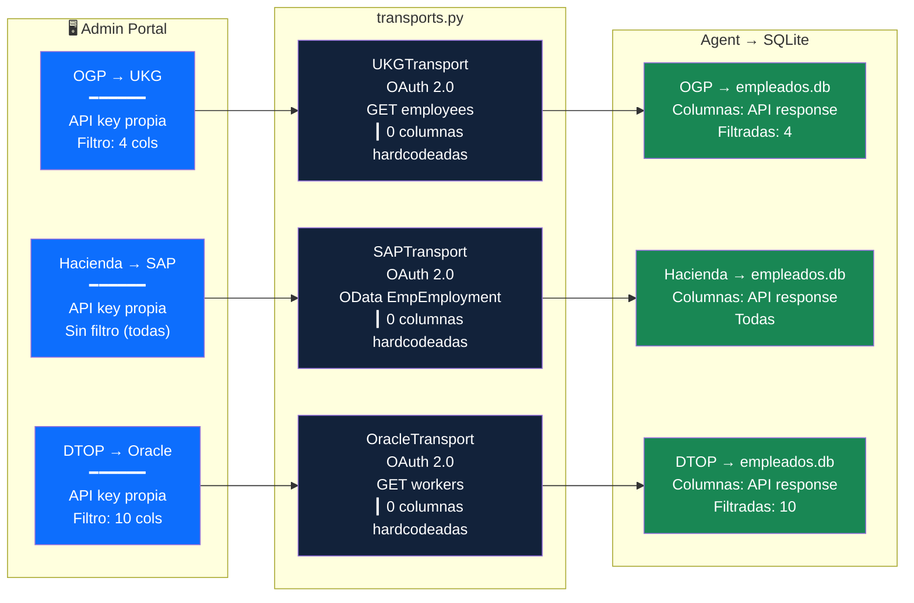
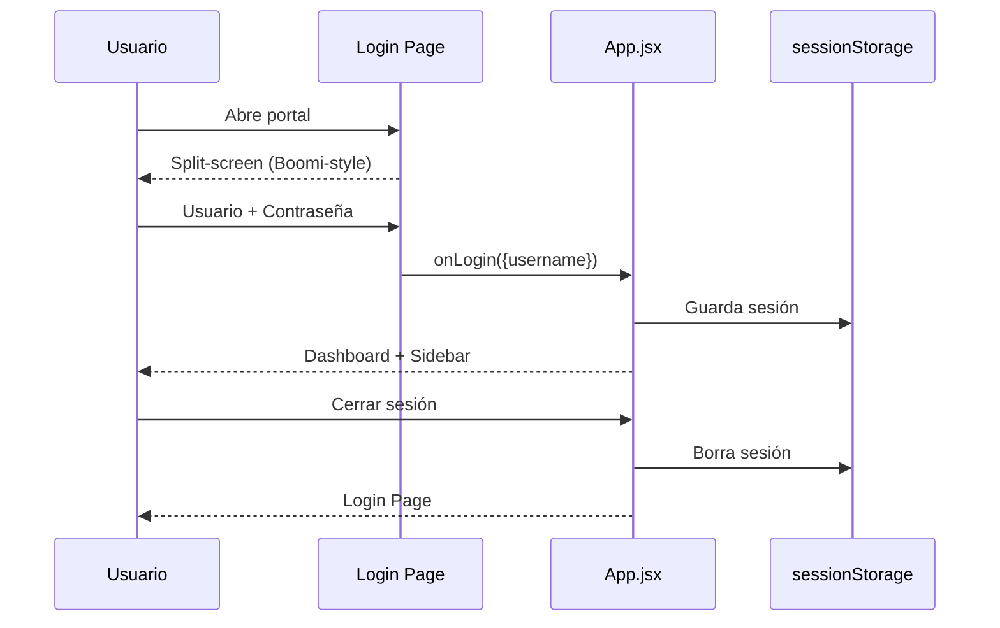
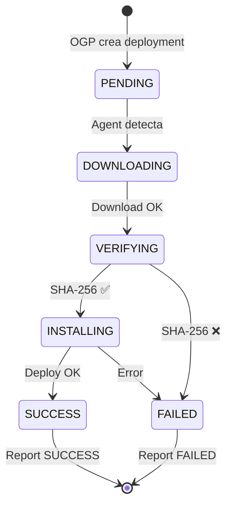
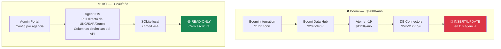

# ASI Architecture — Mermaid Diagrams

## System Overview

El Agent se autentica directo contra UKG/SAP/Oracle. Las columnas las define el API response de la agencia — el Portal solo configura qué columnas **filtrar** al final.



---

## Data Flow — Diario (por agencia)

El Agent no hardcodea columnas. El API response de UKG/SAP/Oracle **define** qué columnas existen. El `selected_columns` del Portal solo filtra al final.



---

## Agent Internals



---

## Portal Admin — Endpoints

```mermaid
graph LR
    subgraph Portal["🖥️ Admin Portal (React)"]
        LOGIN["🔐 Login<br/>Boomi-style"]
        DASH["📊 Dashboard"]
        AGENCIES["🏛️ Agencias"]
        DEPLOY["🚀 Deployments"]
    end

    subgraph API["🌐 Hub API (FastAPI :8900)"]
        E1["PUT /source<br/>UKG|SAP|Oracle"]
        E2["PUT /columns<br/>filtro (API define disponibles)"]
        E3["GET /config<br/>creds + selected_columns"]
        E4["GET /pending"]
        E5["POST /heartbeat"]
    end

    subgraph DB[("SQL Server")]
        AG[("agencies<br/>source_type, creds,<br/>selected_columns")]
        REL[("releases")]
        DEP[("deployments")]
    end

    LOGIN --> DASH
    DASH --> AGENCIES
    DASH --> DEPLOY

    AGENCIES --> E1
    AGENCIES --> E2
    E1 --> AG
    E2 --> AG

    E4 --> DEP
    E4 --> REL

    style LOGIN fill:#0D6EFD,color:#fff
    style DASH fill:#0D6EFD,color:#fff
    style AGENCIES fill:#12223A,color:#fff
    style DEPLOY fill:#12223A,color:#fff
    style E1 fill:#E5BD44,color:#12223A
    style E2 fill:#E5BD44,color:#12223A
    style E3 fill:#E5BD44,color:#12223A
    style AG fill:#198754,color:#fff
```

---

## Configuración por Agencia

Cada agencia tiene su propia API key. El Agent se autentica y el API response define las columnas disponibles. El Portal solo filtra.



---

## Login Flow



---

## Agent Deployment Lifecycle



---

## Comparativa Boomi vs ASI


